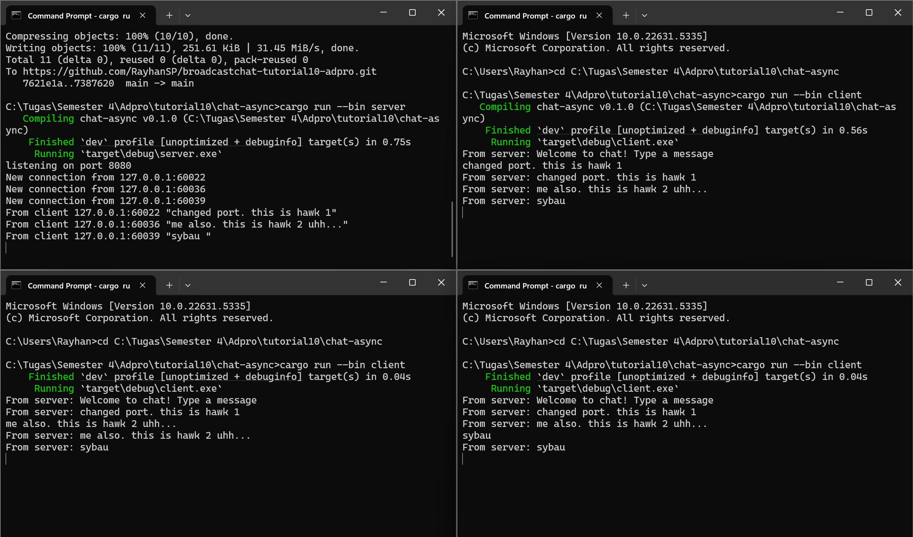
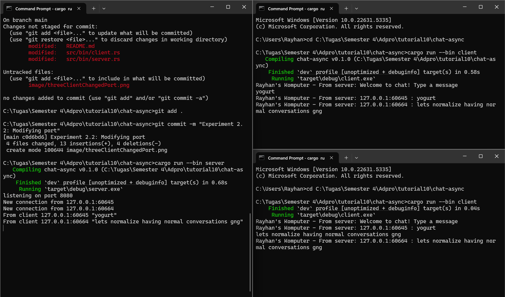

# chat-async

## Experiment 2.1: Original code, and how it runs

Pada eksperimen ini, saya menjalankan satu server dan tiga client untuk chat berbasis WebSocket. Server dijalankan di port 2000, dan masing-masing client berhasil terhubung dan mengirimkan pesan. Ketika satu client mengirim pesan, pesan tersebut berhasil dikirim ke seluruh client lainnya, menandakan bahwa broadcast berjalan dengan baik. Proses komunikasi bersifat asynchronous sehingga semua client dapat mengirim dan menerima pesan secara real-time tanpa blocking. Eksperimen ini menunjukkan bahwa dengan menggunakan tokio_websockets dan channel broadcast dari tokio, kita dapat dengan mudah membuat aplikasi chat sederhana yang bersifat real-time.

### Cara Menjalankan
1. Jalankan server dengan perintah:
   ```bash
   cargo run --bin server
   ```
2. Jalankan tiga client dengan perintah:
   ```bash
   cargo run --bin client
   ```
   Ulangi perintah ini untuk setiap client.

### Hasil
Berikut adalah tangkapan layar dari eksperimen:


## Experiment 2.2: Modifying port

Pada eksperimen ini, port yang digunakan untuk koneksi WebSocket diubah dari 2000 menjadi 8080 pada kedua sisi, yaitu server dan client. Perubahan dilakukan pada bagian `TcpListener::bind` di server dan `ClientBuilder::from_uri` di client. Setelah port diubah, program masih dapat berjalan dengan baik dan komunikasi antar client tetap berlangsung secara real-time. Hal ini menunjukkan bahwa port hanyalah endpoint komunikasi, selama kedua pihak terhubung ke alamat dan protokol yang sama, koneksi tetap berhasil. WebSocket tetap digunakan sebagai protokolnya dan tidak ada perubahan pada mekanisme pengiriman pesan karena semua logika komunikasi tetap berada dalam layer aplikasi.

### Hasil
Berikut adalah tangkapan layar dari eksperimen:



## Experiment 2.3: Small changes, add IP and Port

Pada eksperimen ini, saya menambahkan informasi alamat IP dan port pengirim pada setiap pesan yang diterima oleh client. Perubahan ini dilakukan di sisi server, yaitu dengan memodifikasi `bcast_tx.send(...)` agar menyisipkan data `addr`, yang merepresentasikan alamat dan port client pengirim pesan. Dengan begitu, setiap client yang menerima pesan dapat mengetahui asal pesan tersebut meskipun belum ada identitas atau username yang diimplementasikan. Di sisi client, tampilan output juga diperjelas dengan prefix "Rayhan's Komputer - From server:" untuk membedakan dengan input sendiri. Eksperimen ini membantu kita dalam memahami bagaimana informasi tambahan seperti alamat socket bisa digunakan untuk menambahkan konteks ke dalam komunikasi sederhana.

### Hasil
Berikut adalah tangkapan layar dari eksperimen:

