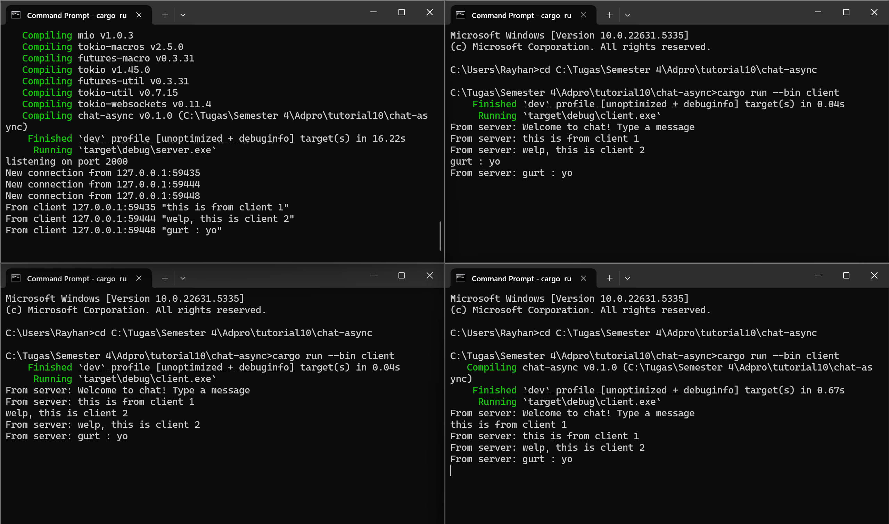

# chat-async

## Experiment 2.1: Original code, and how it runs

Pada eksperimen ini, saya menjalankan satu server dan tiga client untuk chat berbasis WebSocket. Server dijalankan di port 2000, dan masing-masing client berhasil terhubung dan mengirimkan pesan. Ketika satu client mengirim pesan, pesan tersebut berhasil dikirim ke seluruh client lainnya, menandakan bahwa broadcast berjalan dengan baik. Proses komunikasi bersifat asynchronous sehingga semua client dapat mengirim dan menerima pesan secara real-time tanpa blocking. Eksperimen ini menunjukkan bahwa dengan menggunakan tokio_websockets dan channel broadcast dari tokio, kita dapat dengan mudah membuat aplikasi chat sederhana yang bersifat real-time.

### Cara Menjalankan
1. Jalankan server dengan perintah:
   ```bash
   cargo run --bin server
   ```
2. Jalankan tiga client dengan perintah:
   ```bash
   cargo run --bin client
   ```
   Ulangi perintah ini untuk setiap client.

### Hasil
Berikut adalah tangkapan layar dari eksperimen:

